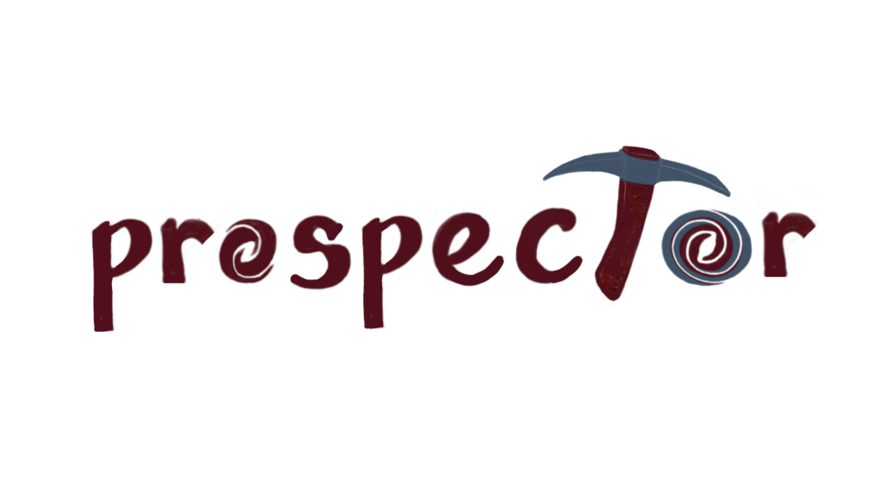

  <!-- . -->
==========

[](https://readthedocs.org/projects/prospect/badge/?version=latest)
[](https://github.com/bd-j/prospector/actions?query=workflow%3ATests)
[](https://arxiv.org/abs/2012.01426)
[](https://github.com/bd-j/prospector/blob/main/LICENSE)

Purpose
-------
Conduct principled inference of stellar population properties from photometric
and/or spectroscopic data.  Prospector allows you to:

* Infer high-dimensional stellar population properties using parametric or
  highly flexible SFHs (with nested or ensemble Monte Carlo sampling)

* Combine photometric and spectroscopic data from the UV to Far-IR rigorously
  using a flexible spectroscopic calibration model and forward modeling many
  aspects of spectroscopic data analysis.

Read the [documentation](http://prospect.readthedocs.io/en/latest/) and the
code [paper](https://ui.adsabs.harvard.edu/abs/2021ApJS..254...22J/abstract).

Installation
------------

See [installation](doc/installation.rst) for requirements and dependencies.
The [documentation](http://prospect.readthedocs.io/en/latest/) includes a tutorial and demos.

To install to a conda environment with dependencies, see `conda_install.sh`.
To install just Prospector (stable release):
```
python -m pip install astro-prospector
```

To install the latest development version:
```
cd <install_dir>
git clone https://github.com/bd-j/prospector
cd prospector
python -m pip install .
```

Then, in Python
```python
import prospect
```


Citation
------

If you use this code, please reference [this paper](https://ui.adsabs.harvard.edu/abs/2021ApJS..254...22J/abstract):
```
@ARTICLE{2021ApJS..254...22J,
       author = {{Johnson}, Benjamin D. and {Leja}, Joel and {Conroy}, Charlie and {Speagle}, Joshua S.},
        title = "{Stellar Population Inference with Prospector}",
      journal = {\apjs},
     keywords = {Galaxy evolution, Spectral energy distribution, Astronomy data modeling, 594, 2129, 1859, Astrophysics - Astrophysics of Galaxies, Astrophysics - Instrumentation and Methods for Astrophysics},
         year = 2021,
        month = jun,
       volume = {254},
       number = {2},
          eid = {22},
        pages = {22},
          doi = {10.3847/1538-4365/abef67},
archivePrefix = {arXiv},
       eprint = {2012.01426},
 primaryClass = {astro-ph.GA},
       adsurl = {https://ui.adsabs.harvard.edu/abs/2021ApJS..254...22J},
      adsnote = {Provided by the SAO/NASA Astrophysics Data System}
}
```

and make sure to cite the dependencies as listed in [installation](doc/installation.rst)

Example
-------

Inference with mock broadband data, showing the change in posteriors as the
number of photometric bands is increased.

