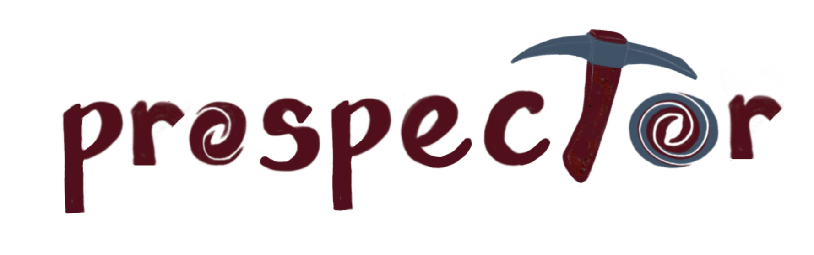

  <!-- . -->
==========

Version 2.0! (in progress)
--------------------------

This is a major refactor to allow for multiple datasets (i.e. multiple spectra)
with different noise models and instrument parameters to constrain a single
galaxy model.  Other updates may include cleaner stored outputs, interfaces with
additional nested samplers, and improved tretments of smoothing.

Work to do includes:

- [x] Convert to/from old style observation dictionaries
- [x] Put responsibility for Noise Models including outlier modeling in individual Observation instances
- [x] Make predictions even when there is no fittable data (e.g. model spectra when fitting photometry only)
- [x] Store Observation objects in HDF5, FITS, etc as structured arrays with metadata
- [x] Catch (and handle) emission line marginalization if spectra overlap.
- [x] Structured ndarray for output chains and lnlikehoods
- [x] Update docs
- [x] Update demo scripts
- [x] Account for undersampled spectra via explicit rebinning.
- [ ] Account for undersampled spectra via a square convolution in pixel space.
- [x] Implement UltraNest and Nautilus backends
- [x] Test i/o with structured arrays
- [ ] Structured ndarray for derived parameters
- [ ] Store samples of spectra, photometry, and mfrac (blobs)
- [ ] Update notebooks
- [ ] Update plotting module
- [ ] Test multi-spectral calibration, smoothing, and noise modeling
- [ ] Test smoothing accounting for library, instrumental & physical smoothing
- [ ] Implement an emulator-based SpecModel class

Nebular emission is computed using [`cuejax`](https://github.com/efburnham/cue), a jax-compatible version of [`cue`](https://github.com/yi-jia-li/cue) ([Li et al. 2024](https://ui.adsabs.harvard.edu/abs/2025ApJ...986....9L/abstract)). 

To install the `cuejax` version adapted to work with this branch of `prospector`:
```bash
git clone https://github.com/yi-jia-li/cue.git
cd cue
git checkout cuejax
pip install .
```

The ionizing spectrum that powers the nebular emission can either be modeled as a 4-segment power-law or fixed to the spectrum of stellar populations ([example](https://github.com/yi-jia-li/prospector/tree/add_cue/demo/prospector+cue.ipynb)):
```py
from prospect.models.templates import TemplateLibrary
TemplateLibrary["cue_nebular"] # Uses a power-law ionizing spectrum
TemplateLibrary["cue_stellar_nebular"] # Uses the stellar ionizing spectrum
```
**Note:** Dust emission is not yet fully implemented for compatibility with nebular emission.

Migration from < v2.0
---------------------

For many users the primary difference from v1.X will be that the data to predict
and fit a model to is now specified as a list of
`prospect.observation.Observation()` instances, instead of a single 'obs'
dictionary.  There is a new convenience method to convert from the old 'obs'
dictionary format to the new specification. This can be used with existing
scripts as follows:

```py
# old build_obs function giving a dictionary
obs_dict = build_obs(**run_params)
# get convenience method
from prospect.observation import from_oldstyle
# make a new list of Observation instances from the dictionary
observations = from_oldstyle(obs_dict)
# verify and prepare for fitting; similar to 'obsutils.fix_obs()'
[obs.rectify() for obs in observations]
print(observations)
```

It is recommended to do the conversion within the `build_obs()` method, if
possible. This list of observations is then supplied to `fit_model`.  Because
noise models are now attached explicitly to each observation, they do not need
to be generated separately or supplied to `fit_model()`, which no longer accepts
a `noise=` argument.  For outlier models, the the noise model should be
instantiated with names for the outlier model that correspond to fixed or free
parameters of the model.

```py
from prospect.fitting import fit_model
output = fit_model(observations, model, sps, **config)
```

Another change is that spectral response functions (i.e. calibration vectors)
are now handled by specialized sub-classes of these `Observation` classes.  See
the [spectroscopy docs](doc/spectra.rst) for details.

The interface to `write_model` has been changed and simplified.  See
[usage](doc/usage.rst) for details.

Finally, the output chain or samples is now stored as a structured array, where
each row corresponds to a sample, and each column is a parameter (possibly
multidimensional).  Additional information (such as sample weights, likelihoods,
and poster probabilities) are stored as additional datasets in the output.  The
`unstructured_chain` dataset of the output contains an old-style simple
`numpy.ndarray` of shape `(nsample, ndim)`


Purpose
-------

[](https://readthedocs.org/projects/prospect/badge/?version=latest)
[](https://github.com/bd-j/prospector/actions?query=workflow%3ATests)
[](https://arxiv.org/abs/2012.01426)
[](https://github.com/bd-j/prospector/blob/main/LICENSE)


Conduct principled inference of stellar population properties from photometric
and/or spectroscopic data.  Prospector allows you to:

* Infer high-dimensional stellar population properties using parametric or
  highly flexible SFHs (with nested or ensemble Monte Carlo sampling)

* Combine multiple photometric, spectroscopic, and/or line flux datasets from
  the UV to Far-IR rigorously using a flexible spectroscopic calibration model
  and forward modeling many aspects of spectroscopic data analysis.

Read the [documentation](http://prospect.readthedocs.io/en/latest/) and the
code [paper](https://ui.adsabs.harvard.edu/abs/2021ApJS..254...22J/abstract).

Installation
------------

See [installation](doc/installation.rst) for requirements and dependencies.
The [documentation](http://prospect.readthedocs.io/en/latest/) includes a tutorial and demos.

To install to a conda environment with dependencies, see `conda_install.sh`.
To install just Prospector (stable release):
```
python -m pip install astro-prospector
```

To install the latest development version:
```
cd <install_dir>
git clone https://github.com/bd-j/prospector
cd prospector
python -m pip install .
```

Then, in Python
```python
import prospect
```


Citation
------

If you use this code, please reference [this paper](https://ui.adsabs.harvard.edu/abs/2021ApJS..254...22J/abstract):
```
@ARTICLE{2021ApJS..254...22J,
       author = {{Johnson}, Benjamin D. and {Leja}, Joel and {Conroy}, Charlie and {Speagle}, Joshua S.},
        title = "{Stellar Population Inference with Prospector}",
      journal = {\apjs},
     keywords = {Galaxy evolution, Spectral energy distribution, Astronomy data modeling, 594, 2129, 1859, Astrophysics - Astrophysics of Galaxies, Astrophysics - Instrumentation and Methods for Astrophysics},
         year = 2021,
        month = jun,
       volume = {254},
       number = {2},
          eid = {22},
        pages = {22},
          doi = {10.3847/1538-4365/abef67},
archivePrefix = {arXiv},
       eprint = {2012.01426},
 primaryClass = {astro-ph.GA},
       adsurl = {https://ui.adsabs.harvard.edu/abs/2021ApJS..254...22J},
      adsnote = {Provided by the SAO/NASA Astrophysics Data System}
}
```

and make sure to cite the dependencies as listed in [installation](doc/installation.rst)

Example
-------

Inference with mock broadband data, showing the change in posteriors as the
number of photometric bands is increased.

