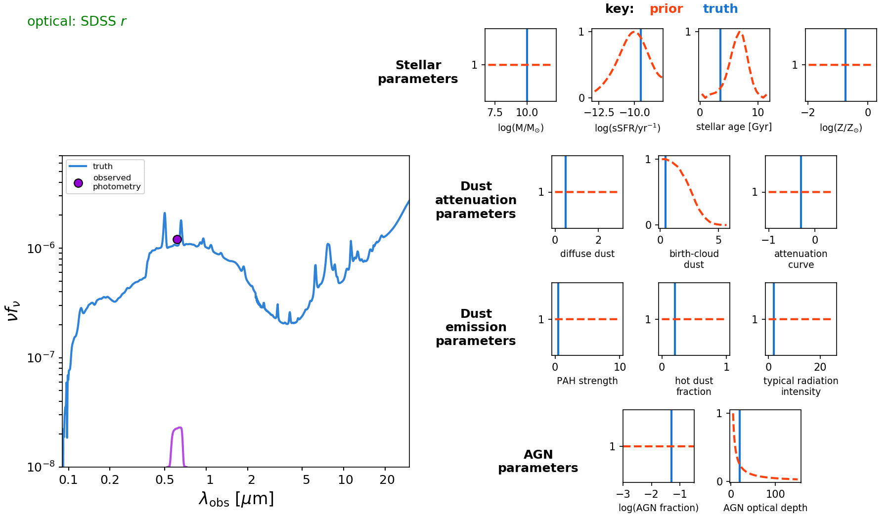

Demonstrations
===============
You can check out the Jupyter notebook demos at

  * `NestedDemo <https://github.com/bd-j/prospector/blob/master/demo/NestedDemo.ipynb>`_
  * `DeconstructedDemo <https://github.com/bd-j/prospector/blob/master/demo/DeconstructedDemo.ipynb>`_

Here is an example of inference from an increasing number of photometric bands.  Model parameters and SEDs are inferred (in grey) from a changing number of mock photometric bands. The mock is generated at the parameters marked in blue.  This shows how with a small amount of data most posteriors are determined by the prior (dashed red) but that as the number of bands increases, the data are more infomative and the posterior distributions are narrower than the prior.

